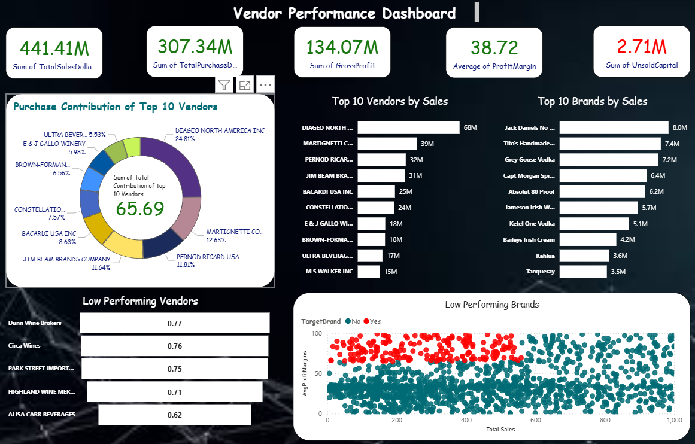

# Data Analysis Using SQL, Python, and Power BI  

This project demonstrates a complete data analysis pipeline using **SQL, Python, and Power BI**. It covers data ingestion, preprocessing, visualization, and dashboard creation for business insights.  


## 🚀 Features  

- **SQL Integration** – Import and query raw datasets into SQL database.  
- **Python for Data Processing** – Handle ingestion, cleaning, and transformation.  
- **Jupyter Notebooks** – Step-by-step walkthroughs for preprocessing and visualization.  
- **Power BI Dashboard** – Interactive dashboard for vendor performance analysis.  
- **Logging System** – Tracks ingestion and preprocessing pipeline status.  

## 🛠️ Requirements  

- Python 3.10+  
- Jupyter Notebook  
- Power BI Desktop  
- Required Python Libraries:  
  ```bash
  pip install pandas numpy matplotlib seaborn sqlalchemy
  ```

## ▶️ Usage  

1. **Data Ingestion**  
   ```bash
   python data_ingestion.py
   ```
   Loads raw data into a database for further processing.  

2. **Data Preprocessing**  
   ```bash
   python data_preprocessing.py
   ```
   Cleans and transforms the data. Logs are saved in `logs/`.  

3. **Exploratory Data Analysis**  
   Open `preprocessing.ipynb` or `Data_Visualization.ipynb` in Jupyter Notebook.  

4. **Power BI Dashboard**  
   Open `VendorPerformanceDashboard.pbix` in Power BI Desktop to explore interactive dashboards.  

## 📊 Dashboard Preview  

Below are sample screenshots from the Power BI dashboard and Python visualizations:  

### Vendor Performance Dashboard (Power BI)  
  
 


## 📌 Notes  

- Ensure your database credentials are properly set in the scripts.  
- Logs are stored in the `logs/` directory for debugging and monitoring.  
